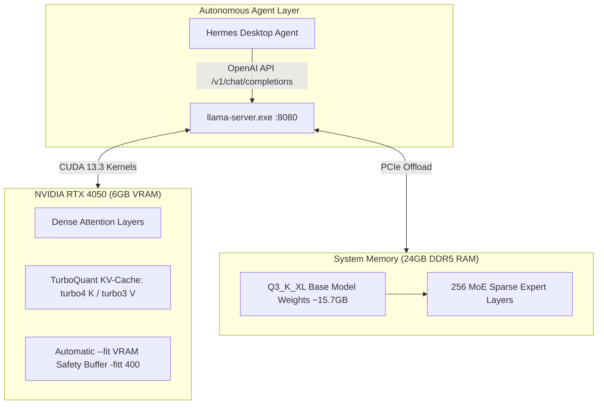

# Qwen3.6-35B Local Agent Setup (6GB GPU / 128K Context)

[-76B900?logo=nvidia&logoColor=white)](https://nvidia.com)
[](https://developer.nvidia.com/cuda-toolkit)
[](https://huggingface.co/Qwen)
[](#-turboquant-kv-cache)
[](#-context-scaling--real-agent-benchmark)
[](LICENSE)

A battle-tested production guide, custom CUDA build pipeline, and automation setup for running **Qwen3.6-35B-A3B** (35B hybrid SSM/MoE) on **consumer 6GB Laptop GPUs** (RTX 4050 / GTX 1060 class) paired with 24GB DDR5 RAM. 

This setup takes direct inspiration from **Codacus**'s optimization walkthrough—[*"Run Qwen 3.6 35B at 17 tokens/sec on 8-year-old hardware"*](https://youtu.be/8F_5pdcD3HY)—and adapts its principles for modern laptop hardware and demanding multi-hour **autonomous coding agent tasks** (Hermes Agent).

---

## 📑 Table of Contents

- [Overview](#-overview)
- [Inspiration: Video Breakdown & Adaptation](#-inspiration-video-breakdown--adaptation)
- [Architecture & Memory Flow](#-architecture--memory-flow)
- [Key Engineering Insights](#-key-engineering-insights)
- [Context Scaling & Real Agent Benchmark](#-context-scaling--real-agent-benchmark)
- [Hardware & Software Requirements](#-hardware--software-requirements)
- [Step-by-Step Installation & Build Guide](#-step-by-step-installation--build-guide)
- [Running the Server](#-running-the-server)
- [Automated Startup](#-automated-startup)
- [Technical Gotchas & Troubleshooting](#-technical-gotchas--troubleshooting)
- [Full Setup Report](#-full-setup-report)
- [License](#-license)

---

## ⚡ Overview

Running a 35B parameter mixture-of-experts (MoE) LLM locally usually requires 24GB+ of dedicated VRAM. By leveraging **selective CPU offloading**, **dynamic VRAM fitting (`--fit`)**, and **TurboQuant CUDA KV-cache compression (`turbo4`/`turbo3`)**, this project makes high-parameter agentic coding accessible on budget consumer hardware.

### Key Highlights
- **Model:** `Qwen3.6-35B-A3B` (256 MoE experts, 8 active per token, hybrid SSM/Mamba + Attention).
- **Quantization:** `Q3_K_XL` (~15.7 GB on disk), matching `Q4_K_XL` in task performance while preserving vital system RAM headroom.
- **Backend:** Custom MSVC + CUDA 13.3 build of `TheTom/llama-cpp-turboquant` (`feature/turboquant-kv-cache`).
- **Context Window:** **131,072 tokens** supported stably at ~14 t/s initial generation speed.
- **Agent Integration:** Connected via standard OpenAI API endpoint to local **Hermes Agent**.

---

## 📹 Inspiration: Video Breakdown & Adaptation

This setup adapts the benchmark optimization pipeline demonstrated by **Codacus** ([Video Link](https://youtu.be/8F_5pdcD3HY)) for running Qwen 3.6 35B on an 8-year-old desktop setup (GTX 1060 6GB VRAM, i3-8100, 24GB DDR4). 

Below is the comparison between the reference video steps and our modern laptop adaptation (RTX 4050 6GB Laptop, i5-13450HX, 24GB DDR5):

### Codacus Reference Video vs. Laptop Agent Adaptation

| Step | Codacus Video Optimization (GTX 1060, 24GB DDR4) | Laptop Agent Adaptation (RTX 4050, 24GB DDR5) | Adaptation Rationale & Hardware Differences |
| :--- | :--- | :--- | :--- |
| **1. Baseline** | Naive split `-L 20` (3 t/s) | Avoided naive manual split | Every layer has MoE blocks; straddling PCIe bus causes severe bottlenecks. |
| **2. Expert Offload** | `--n-cpu-moe 41` (10 t/s) | Handled dynamically by `--fit` | Pinned sleeping MoE experts to RAM; `--fit` auto-tunes tensor offloading without manual guesswork. |
| **3. Disable mmap** | `--no-mmap` (13.5 t/s) | Default OS `mmap` enabled | **Reverted:** `--no-mmap` demands one contiguous block, triggering `std::bad_alloc` (`0xc0000409`) on 24GB Windows. |
| **4. Reclaim VRAM** | `--n-cpu-moe 35` (17 t/s) | `-fit -fitt 400` | Auto-fits max dense layers on GPU while keeping a 400 MiB safety margin. |
| **5. TurboQuant** | `-ctk turbo4 -ctv turbo3` (256k) | `-ctk turbo4 -ctv turbo3` (128k default) | **128k selected:** Empirically yielded 3× higher audit thoroughness on multi-document agent tasks than 256k. |
| **6. RAM Lock** | `--mlock` (System stability) | Omitted (mmap used) | Prevents hard memory locking crashes near the 24GB Windows ceiling. |
| **7. Speculative** | Tested & Rejected (11 t/s drop) | Rejected | Hybrid SSM (30/40 layers) + MoE routing thrash sequential execution across draft windows. |

---

## 🏗 Architecture & Memory Flow

Qwen3.6-35B-A3B uses a hybrid architecture (1 in 4 layers is full attention; 3 in 4 layers are State-Space / Gated Delta Net layers). The memory split distributes dense attention and KV-cache onto the 6GB GPU while offloading the sparse MoE expert weights to system RAM.



---

## 💡 Key Engineering Insights

1. **TurboQuant KV Compression is Essential for >64K Context:**
   Standard `f16` or `q4_0` KV caches exhaust 6GB VRAM rapidly at long contexts. Using `-ctk turbo4` (4-bit Key quantization) and `-ctv turbo3` (3-bit Value quantization) allows 128K context to fit inside GPU memory with ~1GB VRAM safety margin remaining.
2. **`--fit` Beat Manual Expert Stepping:**
   Instead of manually tuning `--n-cpu-moe`, `llama.cpp`'s auto-fit parameters (`-fit -fitt 400`) dynamically evaluate VRAM per-tensor, placing maximum dense layers on GPU while cleanly overflowing experts to host RAM.
3. **`mmap` Over `--no-mmap` / `mlock`:**
   On a 24GB total RAM budget, forcing `--no-mmap` or `mlock` causes Windows `std::bad_alloc` crashes (`0xc0000409 STATUS_STACK_BUFFER_OVERRUN`). Standard OS memory-mapped file loading (`mmap`) prevents hard allocations while keeping paging manageable.

---

## 📊 Context Scaling & Real Agent Benchmark

### Context Scaling Performance (`Q3_K_XL`, CUDA, TurboQuant)

| Context Limit | Loaded? | Free VRAM (Idle) | Generation Speed | System RAM Free | Stability Status |
| :--- | :---: | :---: | :---: | :---: | :--- |
| **64K** | Yes | ~1061 MiB | ~17 t/s | ~7.2 GB | Stable (No TurboQuant required) |
| **128K** | **Yes** | **~992 MiB** | **~14 t/s** | **~5.5 GB** | **Optimal Default (Proven Quality)** |
| **256K** | Yes | ~850 MiB | ~11–13 t/s | ~3.8 GB | High RAM pressure near limit |

### Real-World Autonomous Agent Audit (Hermes Agent Task)

To test beyond synthetic benchmarks, a read-only audit task was conducted against a private ~40-module codebase cross-referencing planning documents vs active architecture:

- **256K Context Run:** Completed in ~22 min wall-clock (6,300 agent tool calls). Identified 1 major architectural contradiction.
- **128K Context Run:** Took ~53 min wall-clock (~18,000 agent tool calls). **Discovered 3 major architectural contradictions** (including hidden code snippet mismatches missed by the 256K run).
- **Takeaway:** At 128K context, the agent performed more deliberate read/verify cycles per document batch, resulting in significantly higher audit thoroughness compared to holding massive text buffers at 256K.

---

## 🖥 Hardware & Software Requirements

### Minimum Hardware
- **GPU:** NVIDIA RTX 4050 Laptop / RTX 3060 / GTX 1060 (6GB VRAM minimum).
- **CPU:** Intel Core i5-13450HX or equivalent (10+ cores / 16 threads recommended).
- **System RAM:** 24GB DDR5 (24GB minimum; 32GB recommended for headroom).
- **Storage:** NVMe SSD (for fast `mmap` model loading).

### Toolchain Dependencies (Windows 11)
- **CUDA Toolkit:** v13.3 (matched to driver UMD version).
- **MSVC Compiler:** v14.44 (Visual Studio 2022 C++ Build Tools).
- **CMake:** v4.4+.
- **Git & PowerShell 7+**.

---

## 🛠 Step-by-Step Installation & Build Guide

### 1. Configure 64-Bit Developer Environment (CRITICAL)

> [!WARNING]
> Launching Visual Studio Developer PowerShell without architecture flags defaults to the **32-bit** host compiler (`Hostx86\x86\cl.exe`), causing CUDA build failures. Ensure you pass `-Arch amd64 -HostArch amd64`.

Open PowerShell as Administrator and navigate to Visual Studio Build Tools:

```powershell
# Launch 64-bit MSVC environment
& "C:\Program Files (x86)\Microsoft Visual Studio\2022\BuildTools\Common7\Tools\Launch-VsDevShell.ps1" -Arch amd64 -HostArch amd64

# Verify 64-bit compiler resolution
where.exe cl.exe
# Output must contain: Hostx64\x64\cl.exe
```

### 2. Clone and Build TurboQuant Fork

```powershell
# Clone TurboQuant feature branch
git clone -b feature/turboquant-kv-cache https://github.com/TheTom/llama-cpp-turboquant.git C:\llama-turboquant
cd C:\llama-turboquant

# Configure CMake for CUDA Ada Lovelace (sm_89 for RTX 4050)
cmake -B build -DGGML_CUDA=ON -DCMAKE_CUDA_ARCHITECTURES=89 -DCMAKE_BUILD_TYPE=Release

# Compile release binaries (takes ~15-20 minutes for CUDA kernels)
cmake --build build --config Release -j
```

---

## 🚀 Running the Server

Start `llama-server.exe` with optimal parameter flags:

```powershell
C:\llama-turboquant\build\bin\Release\llama-server.exe `
  -m "C:\models\Qwen3.6-35B-A3B-UD-Q3_K_XL.gguf" `
  -c 131072 `
  --parallel 1 `
  --port 8080 `
  -fitt 400 `
  -ctk turbo4 `
  -ctv turbo3
```

### Parameter Reference

| Flag | Value | Purpose |
| :--- | :--- | :--- |
| `-m` | `...Q3_K_XL.gguf` | Path to Q3_K_XL quantized GGUF model file |
| `-c` | `131072` | Sets usable context length to 128K tokens |
| `--parallel` | `1` | Restricts to 1 parallel request stream (maximizes VRAM for single agent) |
| `-fitt` | `400` | Reserves 400 MiB safety margin for VRAM allocation |
| `-ctk` | `turbo4` | Enables 4-bit TurboQuant Key KV-cache compression |
| `-ctv` | `turbo3` | Enables 3-bit TurboQuant Value KV-cache compression |

---

## 🤖 Automated Startup

Use the included PowerShell startup script [`start_agent.ps1`](start_agent.ps1) to launch the server, poll health status, and boot your agent app:

```powershell
.\start_agent.ps1 -ModelPath "C:\models\Qwen3.6-35B-A3B-UD-Q3_K_XL.gguf"
```

The script automatically:
1. Detects if `llama-server.exe` is already running.
2. Launches `llama-server` in a minimized window if offline.
3. Polls `http://localhost:8080/health` until HTTP 200 OK is returned.
4. Boots the desktop agent application.

---

## ⚠️ Technical Gotchas & Troubleshooting

### 1. Thinking Mode Routing Mismatch
Qwen3.6 chat template defaults to opening a `<think>` block. Without explicitly turning off thinking mode in API requests, short completion token caps get entirely consumed by invisible reasoning, returning empty strings:

```json
{
  "chat_template_kwargs": {
    "enable_thinking": false
  }
}
```

### 2. Prompt Cache Re-processing Tax
Because Qwen3.6-35B-A3B uses hybrid State-Space / Mamba layers (which are sequential and cannot be trivially cached like pure attention transformers), `llama-server` will log:

```text
forcing full prompt re-processing due to lack of cache data (likely due to SWA or hybrid/recurrent memory)
```

This is expected architecture behavior. Every new turn re-evaluates a portion of prompt context.

### 3. Out of Memory (`STATUS_STACK_BUFFER_OVERRUN`)
If `llama-server` crashes immediately upon launch with code `0xc0000409`, remove `--no-mmap` and `--mlock` flags. Allow Windows to use standard memory-mapped file pages.

---

## 📖 Full Setup Report

For an in-depth empirical log detailing trial failures, quant quality comparisons, and raw agent task metrics, read the full engineering report:

🔗 **[LOCAL_LLM_SETUP_REPORT.md](LOCAL_LLM_SETUP_REPORT.md)**

---

## 📜 License

Distributed under the MIT License. See [`LICENSE`](LICENSE) for details.
